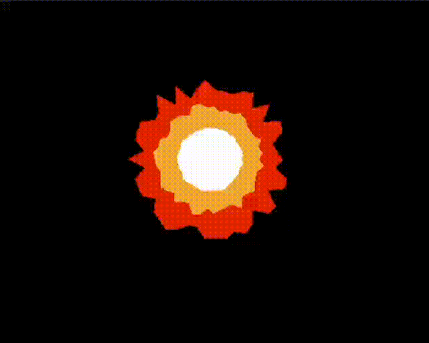

# assignment 4

## output

  

  

## environment
OS: macOS Sonoma 14.2.1  
CPU: arm64 chip
IDE: CLion  
C++: C++14    
C: C99

makefile:

``
make
``

``
./assignment4``

cmakelist:

too lazy to write the command here. But it should work.
